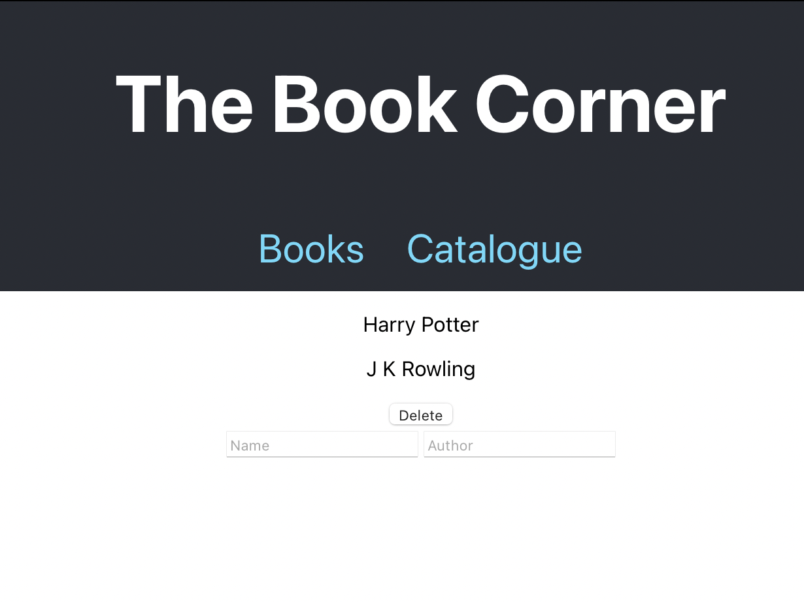

# The Book Corner

A one page app to add and remove books from a list.

## Built With

- HTML/CSS/JavaScript
- Create React App
- React Router
- Redux

## Live Demo

[Netlify Live Demo](https://aesthetic-panda-300b53.netlify.app)

## Getting Started

To get a local copy up and running follow these simple example steps.

- Click on the top right green "code" button.
- On the dropdown menu, choose "download with zip" button.
- After download, extract the zip file and you have the project running on your machine.
- `cd` into the correct directory and `npm install` to intall dependecies.
- Start the project in your browser using `npm start`.

## Authors

👤 **Chris Clothier**

- GitHub: [@CRClothier](https://github.com/crclothier)  
- LinkedIn: [Chris Clothier](https://www.linkedin.com/in/crclothier/)

## 🤝 Contributing

Contributions, issues, and feature requests are welcome!

Feel free to check the [issues page](../../issues/).

## Show your support

Please give a ⭐️ if you like this project!

## Acknowledgments

## 📝 License

This project is [MIT](./LICENCE) licensed.